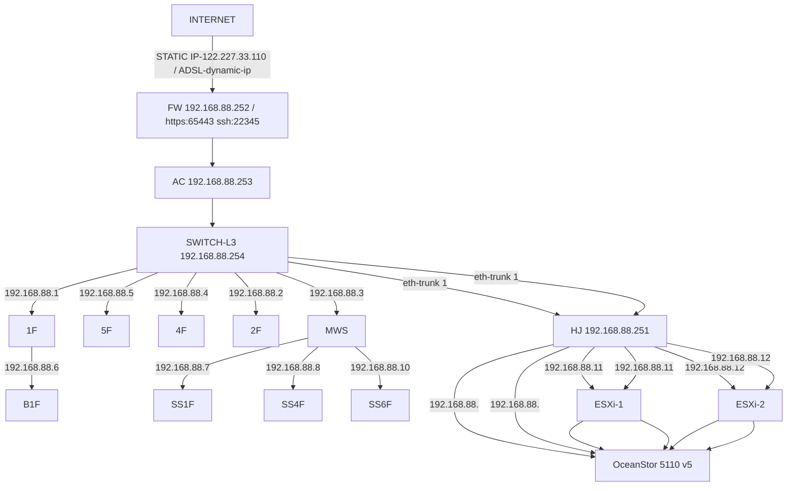
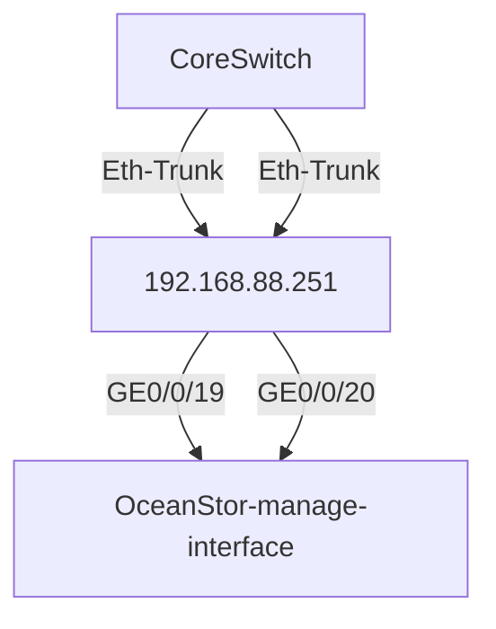
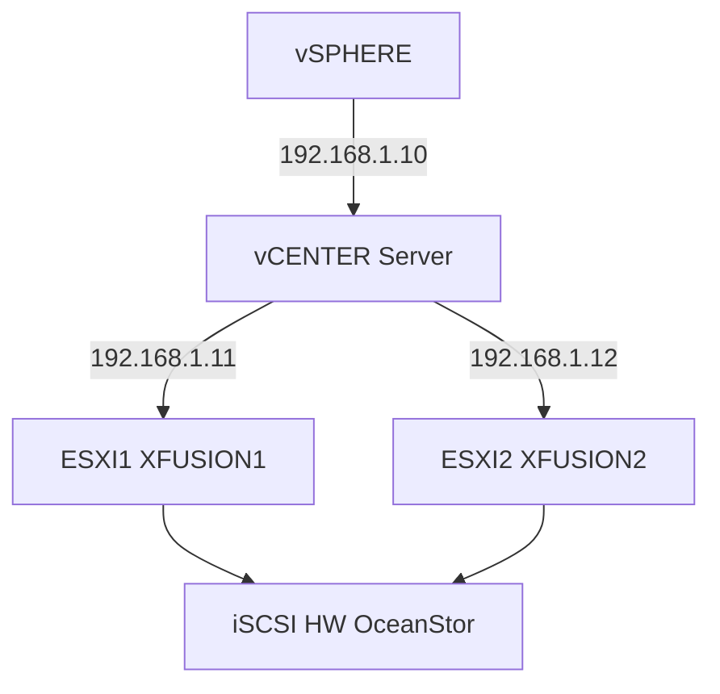

#### Network Devices Topology

```mermaid
graph TB;
    INTERNET --> |STATIC IP-122.227.33.110 / ADSL-dynamic-ip|FW
    FW[FW 192.168.88.252 / https:65443 ssh:22345]--> AC[AC 192.168.88.253];
    AC--> C[SWITCH-L3 192.168.88.254];
    
    C--> |eth-trunk 1|HJ[HJ 192.168.88.251];
    C--> |eth-trunk 1|HJ[HJ 192.168.88.251];
    
    C--> |192.168.88.5|5F[5F ];
    C--> |192.168.88.4|4F[4F ];
    C--> |192.168.88.2|2F[2F ];
    C--> |192.168.88.1|1F[1F ];
    C--> |192.168.88.3|MWS[MWS ];
    1F--> |192.168.88.6|B1F[B1F ];
    MWS--> |192.168.88.7|SS1F[SS1F ];
    MWS--> |192.168.88.8|SS4F[SS4F ];
    MWS--> | 192.168.88.10|SS6F[SS6F];


    HJ--> |192.168.88.11|ESXi-1[ESXi-01]
    HJ--> |192.168.88.11|ESXi-1[ESXi-01]
    
    HJ--> |192.168.88.12|ESXi-2[ESXi-02]
    HJ--> |192.168.88.12|ESXi-2[ESXi-02]
    
    HJ--> |192.168.88.|HWS[OceanStor 5110 v5] 
    HJ--> |192.168.88.|HWS[OceanStor 5110 v5] 
    
    ESXi-1[ESXi-1] --> HWS[OceanStor 5110 v5]
    ESXi-1[ESXi-1] --> HWS[OceanStor 5110 v5]
    
    ESXi-2[ESXi-2] --> HWS[OceanStor 5110 v5]
    ESXi-2[ESXi-2] --> HWS[OceanStor 5110 v5]
    
```

#### HJ Switch interface topology for Virtualization

```mermaid
graph TB;
CoreSwitch-->|Eth-Trunk|HJ[192.168.88.251]
CoreSwitch-->|Eth-Trunk|HJ[192.168.88.251]
HJ --> |GE0/0/19|ESXi1[ESXi1-manage-interface]
HJ --> |GE0/0/20|ESXi1[OceanStor-manage-interface]

```

#### Logic Topology for Virtualization

```mermaid
graph TB;
vSPHERE -->|192.168.1.10|vCENTER[vCENTER Server]
vCENTER -->|192.168.1.11|ESXI1[ESXI1 XFUSION1]
vCENTER -->|192.168.1.12|ESXI2[ESXI2 XFUSION2]
ESXI1 --> iSCSI[iSCSI HW OceanStor]
ESXI2 --> iSCSI[iSCSI HW OceanStor]

```
